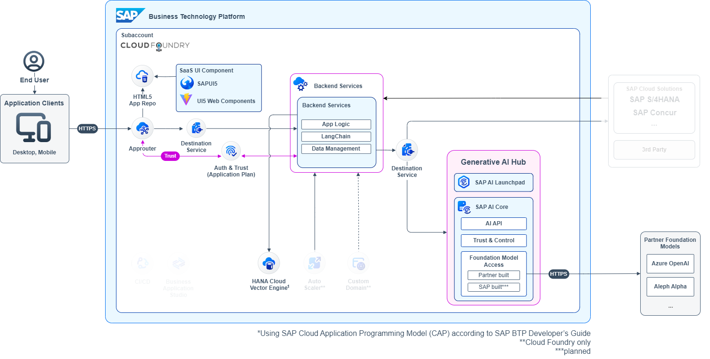

# CAP Application: Semantic Search Integrated with Generative AI Hub and SAP HANA Cloud's Vector Engine
Basic sample for semantic search engine on SAP Business Technology Platform

Register repository https://api.reuse.software/register, then add REUSE badge:

## **Description**
This project is a basic sample for a semantic search engine built on SAP Business Technology Platform (BTP). It uses the Cloud Application Programming (CAP) model and integrates Generative AI Hub and SAP HANA Cloud’s Vector Engine to offer scalable and powerful search capabilities.

**Key Features:**
- Semantic search powered by SAP HANA Cloud's Vector Engine.
- Generative AI integration using the Generative AI Hub.
- Modular structure with a CAP backend and SAPUI5 frontend.

### **Project Structure**
- **`api/`**: Contains backend logic, data models, service definitions, and business logic.
- **`ui/`**: Contains frontend components like views, controllers, and assets using TypeScript and SAPUI5.

## Getting Started
1. [Requirements](https://github.com/SAP-samples/btp-cap-genai-semantic-search/blob/main/docs/tutorial/1-Requirements.md)
2. [Setup and Deploy](https://github.com/SAP-samples/btp-cap-genai-semantic-search/blob/main/docs/tutorial/2-Setup%20and%20Deploy.md)
3. [Data Model](https://github.com/SAP-samples/btp-cap-genai-semantic-search/blob/main/docs/tutorial/3-Data%20Model.md)
4. [UI Setup](https://github.com/SAP-samples/btp-cap-genai-semantic-search/blob/main/docs/tutorial/4-UI%20Setup.md)
5. [Validation and Testing](https://github.com/SAP-samples/btp-cap-genai-semantic-search/blob/main/docs/tutorial/5-Validation%20and%20Testing.md)
6. [Extend](https://github.com/SAP-samples/btp-cap-genai-semantic-search/blob/main/docs/tutorial/6-Extend.md)

## How to obtain support
[Create an issue](https://github.com/SAP-samples/btp-cap-genai-semantic-search/issues) in this repository if you find a bug or have questions about the content.
 
For additional support, [ask a question in SAP Community](https://answers.sap.com/questions/ask.html).

## Contributing
If you wish to contribute code, offer fixes or improvements, please send a pull request. Due to legal reasons, contributors will be asked to accept a DCO when they create the first pull request to this project. This happens in an automated fashion during the submission process. SAP uses [the standard DCO text of the Linux Foundation](https://developercertificate.org/).

## License
Copyright (c) 2024 SAP SE or an SAP affiliate company. All rights reserved. This project is licensed under the Apache Software License, version 2.0 except as noted otherwise in the [LICENSE](LICENSE) file.
